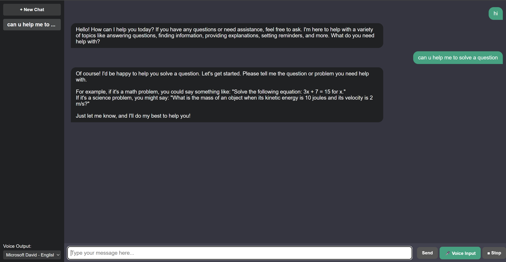

# AI Chatbot Web App

A full-stack AI-powered chatbot application built with React (frontend) and Flask (backend). This project demonstrates real-time chat, persistent user history, and voice input/output, all powered by an intelligent language model via the OpenRouter API.

## Features
- **Conversational AI**: Context-aware responses using OpenRouter's large language model.
- **Modern UI**: Responsive React frontend with chat history, multi-chat support, and voice settings.
- **Voice Input/Output**: Speak to the bot and hear its replies using browser APIs.
- **Persistent History**: User chat history is stored in a MySQL database.
- **RESTful API**: Clean separation between frontend and backend.

## Screenshots
 <!-- Add your screenshot here -->

## Getting Started

### Prerequisites
- Python 3.8+
- Node.js & npm
- MySQL Server

### Backend Setup
1. Install dependencies:
   ```powershell
   cd backend
   pip install -r requirements.txt
   ```
2. Set up the database:
   - Start MySQL and run the SQL script:
     ```powershell
     mysql -u root -p < init.sql
     ```
3. Create a `.env` file in `backend/` (see `.env.example`):
   ```env
   DB_HOST=localhost
   DB_USER=your_mysql_user
   DB_PASSWORD=your_mysql_password
   DB_NAME=chatbot_db
   OPENROUTER_API_KEY=your_openrouter_api_key
   ```
4. Start the backend server:
   ```powershell
   python app.py
   ```

### Frontend Setup
1. Install dependencies:
   ```powershell
   cd ../frontend
   npm install
   ```
2. Create a `.env` file in `frontend/`:
   ```env
   REACT_APP_API_URL=http://localhost:5000
   ```
3. Start the frontend:
   ```powershell
   npm start
   ```

### Usage
- Open [http://localhost:3000](http://localhost:3000) in your browser.
- Type or speak your message to chat with the AI bot.
- Switch between chats and review your conversation history.

## Project Structure
```
backend/
  app.py           # Flask app
  chat_logic.py    # AI logic and OpenRouter API integration
  db.py            # MySQL database functions
  init.sql         # Database schema
frontend/
  src/App.js       # Main React app
  src/App.css      # Styles
  public/index.html
```

## Deployment
You can deploy the backend and frontend separately (e.g., Render, Vercel, Heroku). For portfolio/demo purposes, you may also share your [GitHub repository](https://github.com/yourusername/your-chatbot-repo) with setup instructions.

## License
MIT

---
**Note:** You need an OpenRouter API key and a running MySQL server to use this app locally.
